# Configure Data Lineage in IBM Cloud Pak for Data

Data lineage is the process of tracking the flow of data over time, providing a clear understanding of where the data originated, how it has changed, and its ultimate destination within the data pipeline. It provides an audit trail for data at a very granular level. Refer to “[What is data lineage](https://www.ibm.com/topics/data-lineage)?” for more details.

When Cloud Pak for Data (CP4D version 4.5.3 or later) is installed and Watson Knowledge Catalog (WKC) is enabled in an OpenShift cluster, the data lineage operator named “MANTA Automated Data Lineage” is installed automatically. 

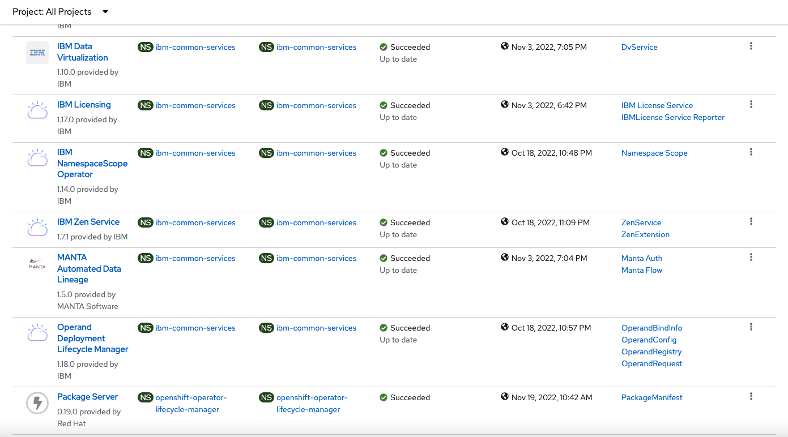

However, the data lineage feature must be configured before it’s available for use in WKC. This document outlines the configuration steps.

## Obtain Manta License Key

Manta is broadly available in data technologies by companies such as IBM, Google, Amazon, Microsoft, SAP, Snowflake, Tableau, Talend, and Teradata. Refer to [Manta licensing policy](https://getmanta.com/licensing-policy/) for more details. The licenses for data lineage from Manta are available through purchases of cloud services.

The license key is presented in an XML format and saved in a license.key file. This file will be used later when it is applied to Manta containers.
```
<license>
    <version>v4</version>
    <validity>2023-03-14</validity>
    <scripts>3000</scripts>
    <connections>0</connections>
    <type>PARTNER</type>
    <revisions>3</revisions>
    <products>mf</products>
    <products>mf_all</products>
    <products>mr_basic</products>
    <products>mr_exporter</products>
    <products>mr_igc</products>
    <products>mr_importer</products>
    <products>mr_integration</products>
    <products>mr_interpolation</products>
    <products>mr_merger</products>
    <products>mr_openexport</products>
    <products>mr_orchestration</products>
    <products>mr_perspectives</products>
    <products>mr_viewer</products>
    <licensee>IBM internal/demo use only</licensee>
    <hash>P2kr … LnQ==</hash>
</license>
```

## Enable Manta Automated Data Lineage in OpenShift 

Enabling the lineage feature of MANTA Automated Data Lineage is an optional step and is only needed if you want to import lineage information in addition to basic metadata.

To enable Manta and Knowledge Graph, go to custom resources under Administration in OpenShift. Search "wkc", and open it. Select the Instances tab, and click on "wkc-cr" instance. Open and modify the Yaml file and change both "enableManta" and "enableKnowledgeGrpha" to "true".

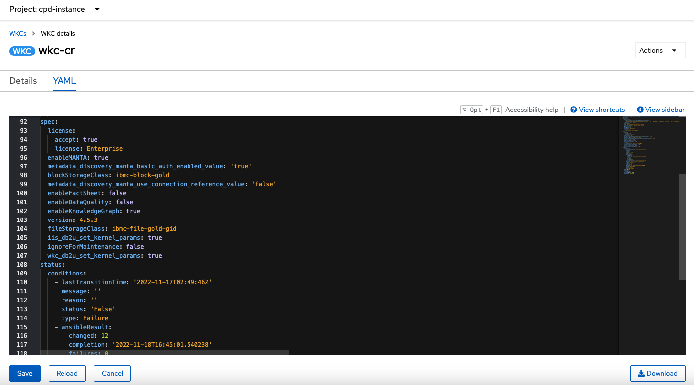

Alternatively, you can use the oc command to enable Manta and Knowledge Graph.

```
oc project cpd-instance
oc edit wkc wkc-cr
```

It may take 15 minutes or longer to update the custom resource. To check the status, run the following oc command and ensure that all three pods are running and the wkc-cr status is "completed".

```
oc get pod |grep manta
oc get wkc

manta-artemis-ccffd5958-6hls2                                1/1     Running     0                 4d19h
manta-dataflow-6b4f4fb66f-hp8rh                              1/1     Running     1 (6h5m ago)      6h12m
manta-keycloak-6ffc96d7d4-mpk5k                              1/1     Running     0                 8h
NAME     VERSION   RECONCILED   STATUS      AGE
wkc-cr   4.5.3     4.5.3        Completed   4d22h
```

## Apply Manta License Key

You can add, update or view the license key from the OpenShift console. Select Secrets under Workloads from the left side navigation pane. Search for "manta" in all projects or the project where Manta operator is installed, for example, "cpd-instance". Locate and click on "manta-keys". Click "Edit Secret" under Actions. Add a new key-pair or modify an existing one.

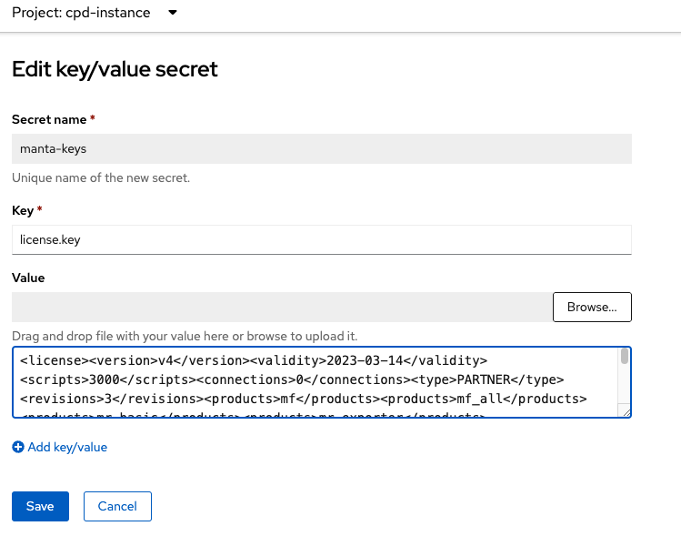

Alternatively, you can log in to OpenShift and apply the license key using the oc command. See "[Enabling lineage import](https://www.ibm.com/docs/en/cloud-paks/cp-data/4.5.x?topic=administering-enabling-lineage-import)" for more details.

```
oc set data secret/manta-keys -n <namespace> --from-file=license.key=./license.key
```

If you try to use data lineage for the update completes, you will be asked to provide a valid license key. Use the `oc get wkc` command to ensure that WKC is ready.

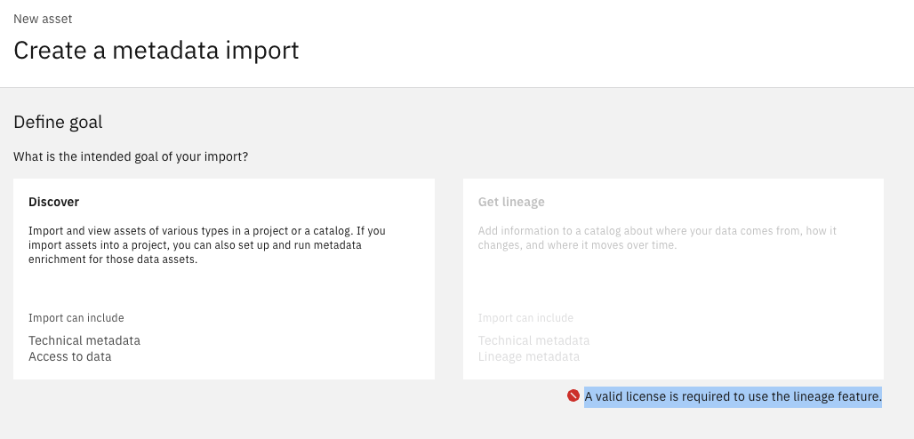


## Configure Data Lineage Using Self-signed Certificates

This step is optional and only applicable if self-signed certificates are used. 

Download the the "cert-tool.tar" file, or “[cert-tool](https://github.ibm.com/wdp-gov/cert-tool)” from Github, which contains scripts to create and apply certificates to Manta services. This tool is currently available to IBM employees only. 

You can then extract the file to a local folder on your Linux or Mac. The scripts are now available.

```
tar -xvf cert-tool.tar
chmod 775 cert-tool
cd cert-tool
```

The tool depends on “[jq](https://stedolan.github.io/jq/download/)” so make sure that you download and install it on your local machine.

### Create and Apply Certificates for Manta

Before running any scripts, update the several values in the config.properties file, cn, dns, and route. You can keep the cert_alias "as is" or rename it, and leave cert_filename and cert_key_filename blank unless you are using existing ones.

```
# Common Name (CN)
# Example: cpd-wkc.apps.orion.cp.fyre.ibm.com
# Important: This value must not exceed 64 characters, use a wildcard entry if it does
#    Example: *.cp.fyre.ibm.com
cn=*.xxx.containers.appdomain.cloud

# DNS entry used in subject alternative names field (SAN)
# Example: cpd-wkc.apps.orion.cp.fyre.ibm.com
# Important: Always use the fully qualified domain name in this field.
dns=cpd-cpd-instance.xxx.xxx.containers.appdomain.cloud

# Project/namespace where WKC is installed.
project=cpd-instance

# Route name (Example: oc get route -n wkc)
route=cpd

# Certificate alias.
cert_alias=ibm-nginx

# Configuration for existing certificates.
# Specify the certificate filename, key filename for existing certificates here.
# Supported formats: X.509 v1, v2, and v3 certificates, 
#    and PKCS#7 formatted certificate chains consisting of certificates of that type
cert_filename=
cert_key_filename=
```

Ensure that WKC has been eanbled and the "wkc-cr" resource shows the "Completed" status, not "InProgress", as discussed before. Then, run the following command to install the certificates and enable basic authentication by entering "y" at the prompt. 

```
./install.sh
```

The install.sh script creates two certificate files, ibm-nginx.crt and bm-nginx.key, based on the values in the configu.properties. If you are running the script for another OpenShift, move the two files to a different folder or change the cert_alias value. Creating certificates for one cluster and applying them to a different cluster will result in errors subsequently. For example, when logging in to the Manta portal, you may see a blank screen, or when you run "./validate.sh", you may see incorrect connection to the service. 

```
./validate.sh
Already on project “cpd-instance” on server “https://xxx.containers.cloud.ibm.com:31162”.
Checking for alias: ibm-nginx in mantaflow keycloak.jks... OK
Checking for alias: ibm-nginx in manta-dataflow-server keycloak.jks... OK
Checking for alias: ibm-nginx in java cacerts... OK
IAM integration enabled: <no value>
Config map: metadata-discovery-service-config
  Basic auth enabled: true
  Use connection reference: false
grep: invalid option -- P
usage: grep [-abcdDEFGHhIiJLlMmnOopqRSsUVvwXxZz] [-A num] [-B num] [-C[num]]
	[-e pattern] [-f file] [--binary-files=value] [--color=when]
	[--context[=num]] [--directories=action] [--label] [--line-buffered]
	[--null] [pattern] [file ...]
```

### Enable Signle Sign On Integration

If the single sign on (SSO) is enabled in the cluster, you can also enable SSO integration with Manta at the step. The "install.sh" script automatically updates the registration.json file in the sso folder.

```
{
  "token_endpoint_auth_method": "client_secret_basic",
  "client_id": "manta",
  "client_secret": "f7Eh3B5jaC",
  "scope": "openid profile email",
  "grant_types": [
    "authorization_code",
    "client_credentials",
    "password",
    "implicit",
    "refresh_token",
    "urn:ietf:params:oauth:grant-type:jwt-bearer"
  ],
  "response_types": ["code", "token", "id_token token"],
  "application_type": "web",
  "subject_type": "public",
  "post_logout_redirect_uris": ["https://xxx.containers.cloud.ibm.com:30182"],
  "preauthorized_scope": "openid profile email general",
  "introspect_tokens": true,
  "trusted_uri_prefixes": [
    "https://xxx.containers.cloud.ibm.com:30182",
    "https://xxx.containers.cloud.ibm.com:30182"
  ],
  "redirect_uris": [
    "https://xxx.containers.cloud.ibm.com:30182/manta/auth/realms/manta/broker/iam/endpoint"
  ]
}
```

Note that SSO is not required and if it is not enabled, you can use basic authentication to log in to the Manta administration portal.

### Obtain Manta Admin Credentials

You can find the basic authenticaiton password from the OpenShift console. Select Secrets under Workloads from the left side navigation pane. Search for "manta" or "credentials" in all projects or the project where Manta operator is installed, for example, "cpd-instance". Locate and click on "manta-credentials". Scroll down the page and copy the "Manta_Password".

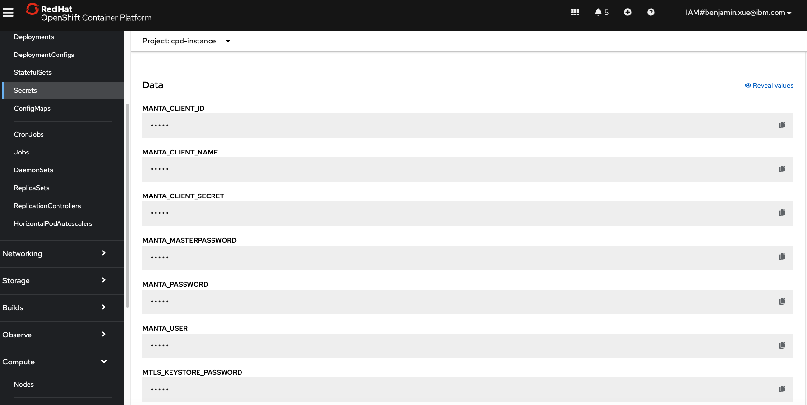


### Update Manta License Key with the Script

Alternatively, you can update the Manta license key using the following command if necessary.

```
./update_license.sh
```

## Verify Data Lineage

To verify that data lineage is working propertly, add a new asset to a project from the CP4D console. Click on "Metadata import", and select "Get lineage". If the option is grayed out, data lineage is not enabled or not configured propertly.
   
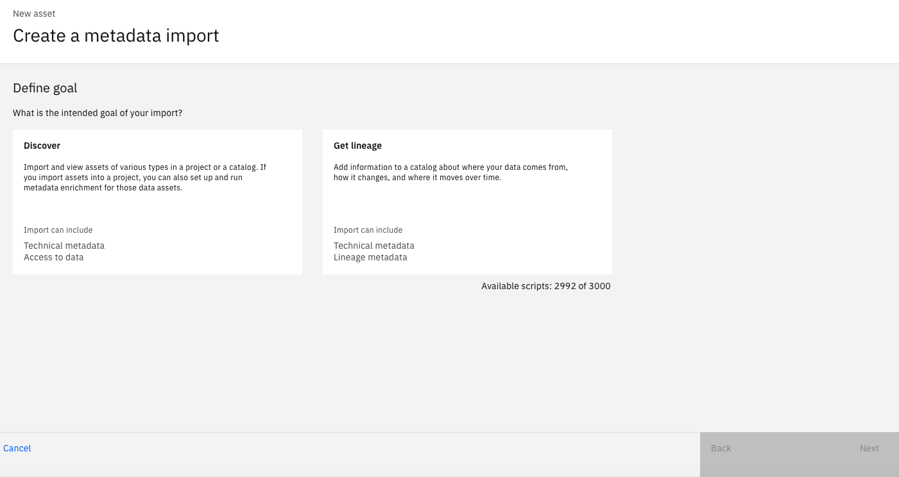

Alternatively, you can run the oc command to check if Manta data lineage has been eabled. Also, you can vefify if signle sign on or basic authentication has been enabled.

```
oc get wkc wkc-cr -o yaml|grep -i manta

  enableMANTA: true
  metadata_discovery_manta_basic_auth_enabled_value: "true"
  metadata_discovery_manta_use_connection_reference_value: "false"

```

## Use Data Lineage

To use data lineage, you can create a new asset and import metadata with data lineage. Once the import job is completed, which takes several minutes, you can open a dataset and view the data lineage.

In a sample database with tables and stored procedures, you can see two types of data lineage: business data lineage and technical data lineage.

Business Data Lineage

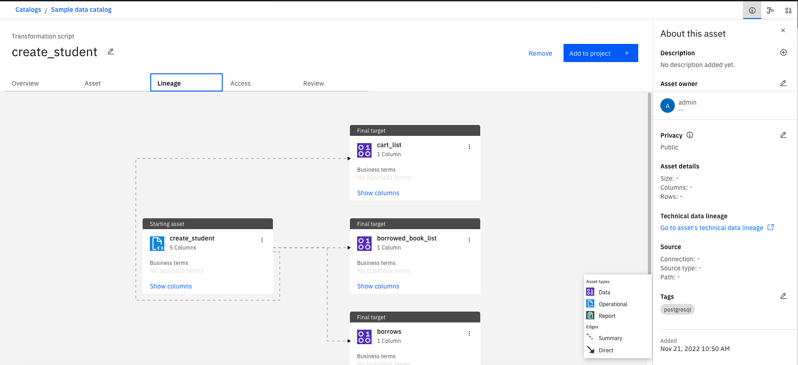

Technical Data Lineage

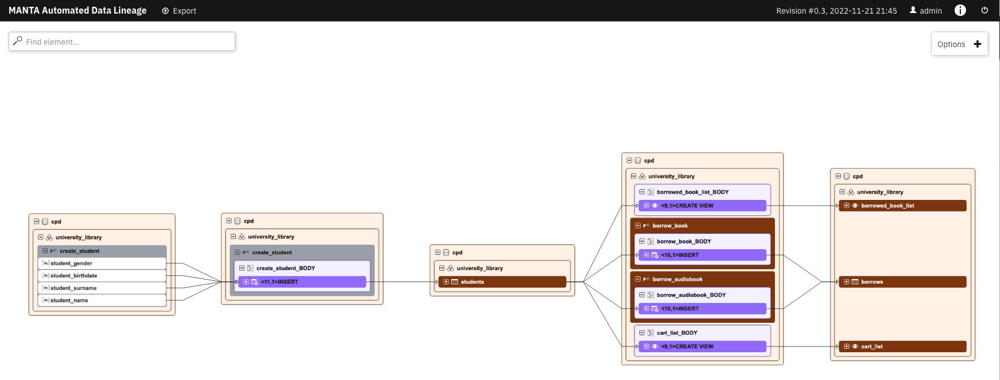

## Troubleshoot Data Lineage

If for any reason data lineage does not appear to be working in your environment, make sure that data lineage has been eabled and updated with proper license. See more details in the "Verify Data Lineage" section.

### Incompatible CP4D Versions

Manta Automated Data Lineage is available and supported in CP4D version 4.5.3 or higher. If an incompatible version of CP4D is installed, you may notice that the Manta operator is not installed property.  Even if you try to install it manually, that is, deleting the subscription and creating a new one, the installation or update may not succeed. The easy fix is to install CP4D in a new cluster.

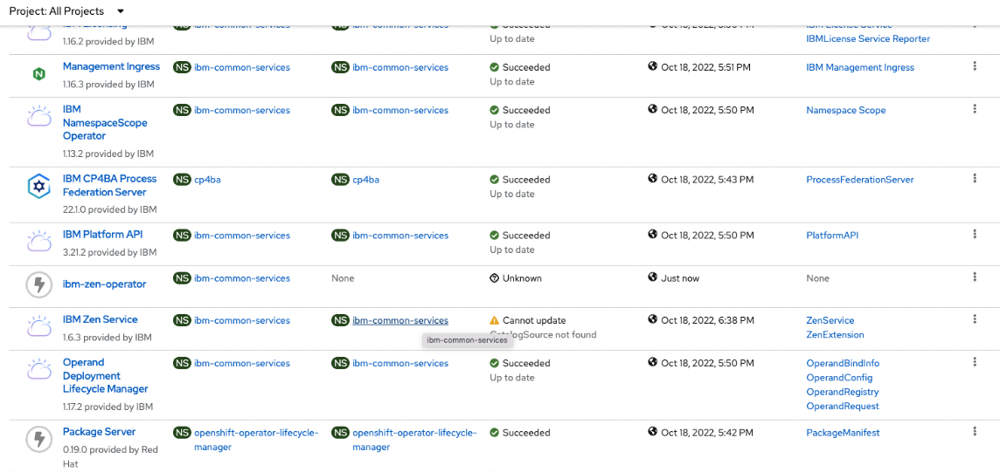

### OpenShift Worker Nodes

If the OpenShift cluster has been provisioned without adequate computing resources, e.g. CPUs and memories, you may experience issues with data lineage, for example, data lineage import job failure and profile data failure.

While there are no definitive data, we are able to address one data lineage issue by replacing one 7-node cluster with a five-node cluster that comes with 32 cores and 128GB on each node.

Seven-node cluster

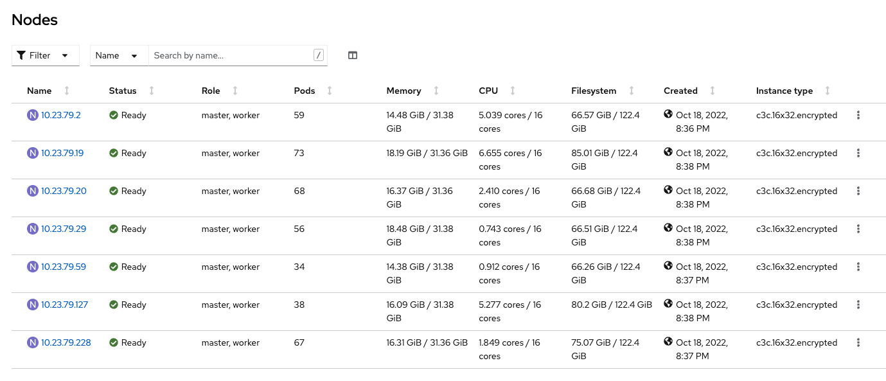

Five-node cluster

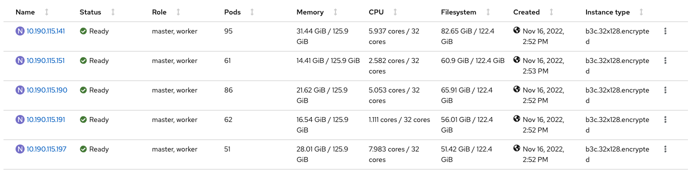

### Check RabbitMQ Pods

The IBM Support team would ask you to check if the RabbitMQ pods are running. Go to the admin console of the OpenShift cluster, select Pods under Workloads from the left side navigation panel. Enter "rabbitmq" in the search box. You will see something similar to the screen below. Make sure all the RabbitMQ pods are running.

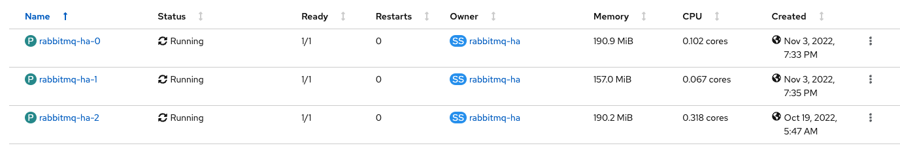

### Check Data Lineage License and Process Manager

You can log in to the Manta admin console which is available in the same cluster. If single sign one is not eabled, you will need the admin's password. 

To view and update licensing information, use the url below. Or, click on "Configuration" from the top, and select "License" from the left side. 

```
<CP4D url>/manta-admin-gui/app/index.html#/platform/license
```

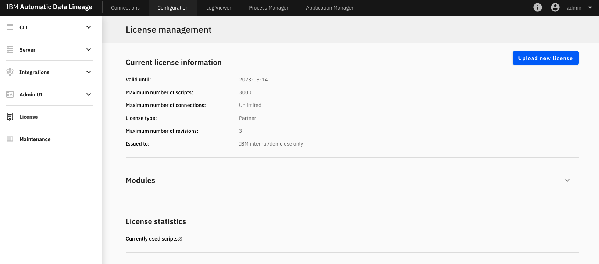

To view the process manager and logs, use the url below. Or, click on "Process Manager" from the top.

```
<CP4D url>/manta-admin-gui/app/index.html#/platform/processmanager
```

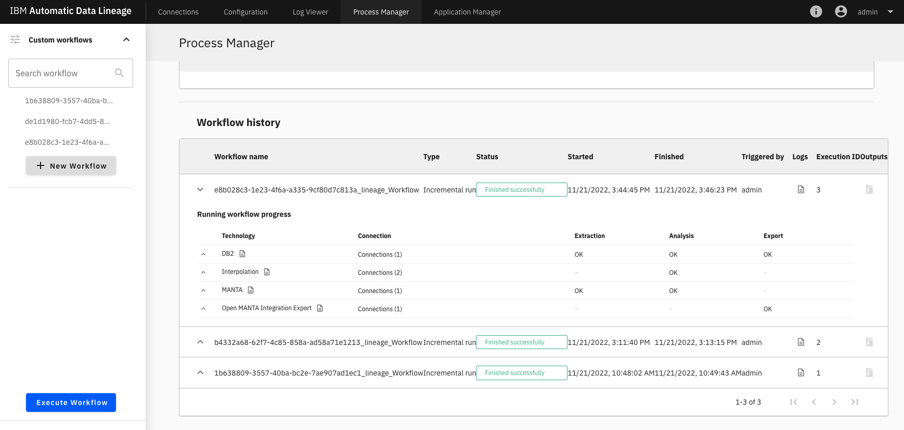

You can download the logs in Zip format under the Outputs column on the left side. This is useful information when you contact the IBM Support team.

### Fix Manta Flow Server and CLI License Issue

You may notice a license issue that "Flow Server and CLI have different licenses" in Manta admin console as shown. 

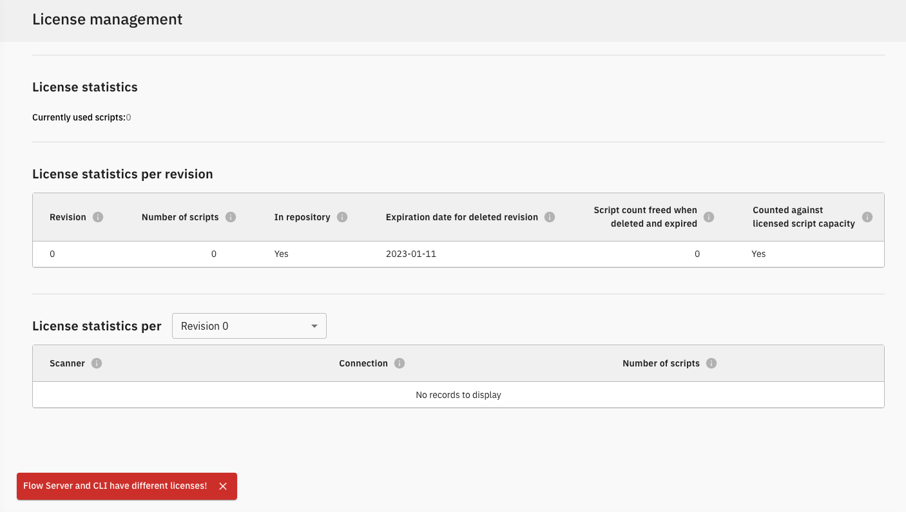

You can fix the issue by deleting the manta dataflow pod, and the two metadata pods, metadata-discovery=xxx and wkc-metadata-imports.

Delete Manta Dataflow Pod
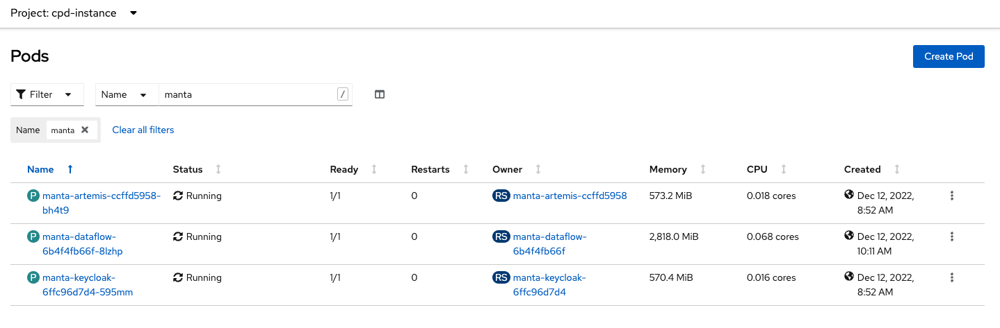

Delete Manta Metadata Pods
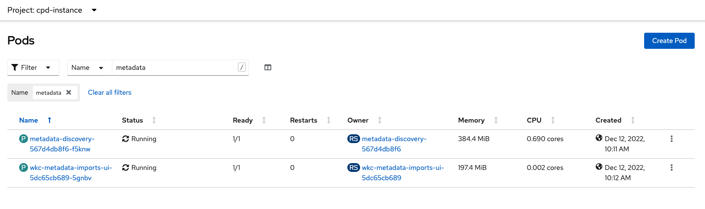

### Enabling WKC Issue

You may encounter issues when trying to enable WKC, DB2, Data Management Console, and other services at once with Daffy. 

```
FAILED:IBM Watson Knowledge Catalog instance could not be installed
```

One workaround is that you enable WKC first, and then enable DB2 and other services by setting their variables to true and running the `service.sh` command again and don't have to wait until WKC is completed. 

```
/data/daffy/tmp/cpdcli/cpd-cli-linux-EE-11.3.0-52/cpd-cli manage apply-olm --release=4.5.3 --cpd_operator_ns=ibm-common-services --components=wkc
⏰  TIMER 11 minutes have elapsed

COMPLETE  WKC Operator installed
wkc.wkc.cpd.ibm.com/wkc-cr unchanged

Your request to install the service has been submitted.  It can take 3 hours or more.
To check on the status of your service, you can run the following command:
/data/daffy/cp4d/service.sh <cluster name> --WKCStatus
```

You can check the status for WKC with the following command.

```
/data/daffy/cp4d/service.sh <cluster name> --WKCStatus
```

## Contributors

Many thanks to the WKC team who provided configuration and troubleshooting guidance during the process, specifically Andrew Wang, Andrzej Wrobel, Jojo Joseph, Sathis Marudanayagam Rajendra.